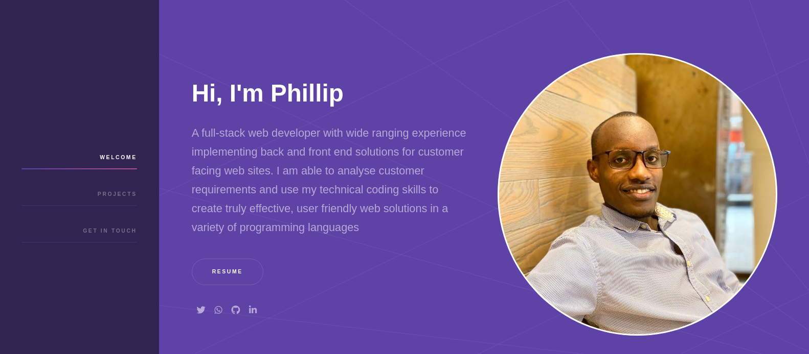
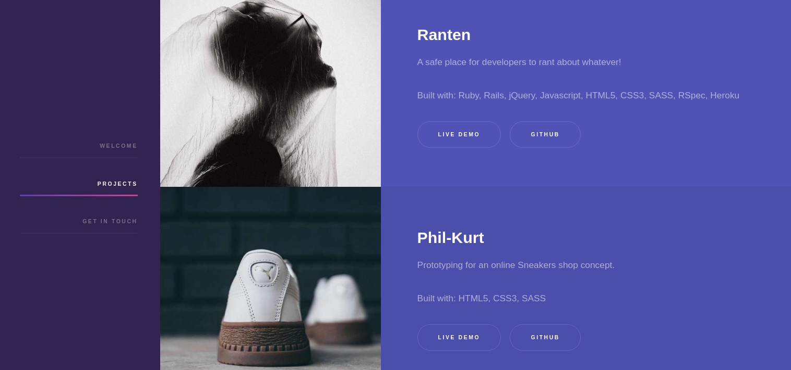
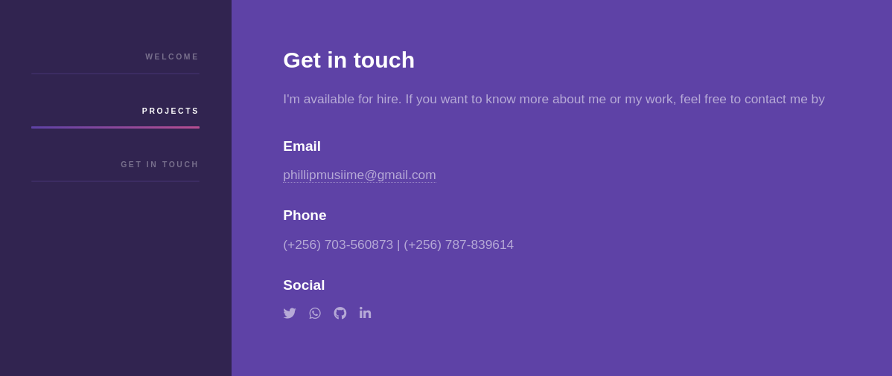

# My Portfolio
My personal website which is intended to give a summary of my general experience as a web developer. It showcases some of the projects i have worked on and links to other resources like my resume, github repository and contacts.

This project in particular is a real-world-like project, built with real world business specifications.
 
 
## Screenshots
 

 

 

 

 
 

 

 

## Built with
  * HTML
  * SASS (SCSS)
  * JavaScript

## Live demo
[Live Demo Link](https://github.com/PhillipUg/phillipug.github.io)

## Author

 :bust_in_silhouette:
 * Github: https://github.com/PhillipUg
 * Twitter: https://twitter.com/Phillip_Ug
 * LinkedIn: https://www.linkedin.com/in/phillip-musiime

## Contributing
Contributions, issues and feature requests are welcome!

   1. Fork the Project
   2. Create your Feature Branch (git checkout -b feature/AmazingFeature)
   3. Commit your Changes (git commit -m 'Add some AmazingFeature')
   4. Push to the Branch (git push origin feature/AmazingFeature)
   5. Open a Pull Request

Feel free to check the [issues page](https://github.com/PhillipUg/phillipug.github.io/issues).

## Show your support
Give a :star: if you like this project!

## Acknowledgements
  * [Microverse](https://www.microverse.org/)
  
## License
 Distributed under the MIT License.
